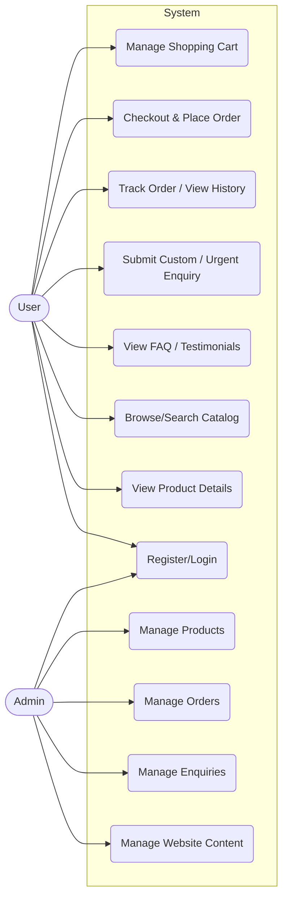
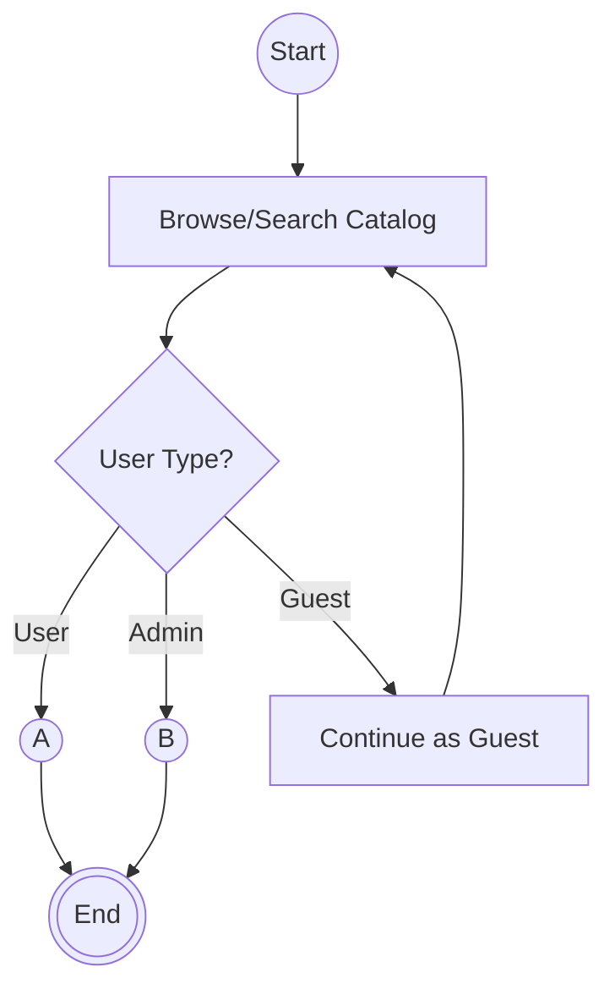
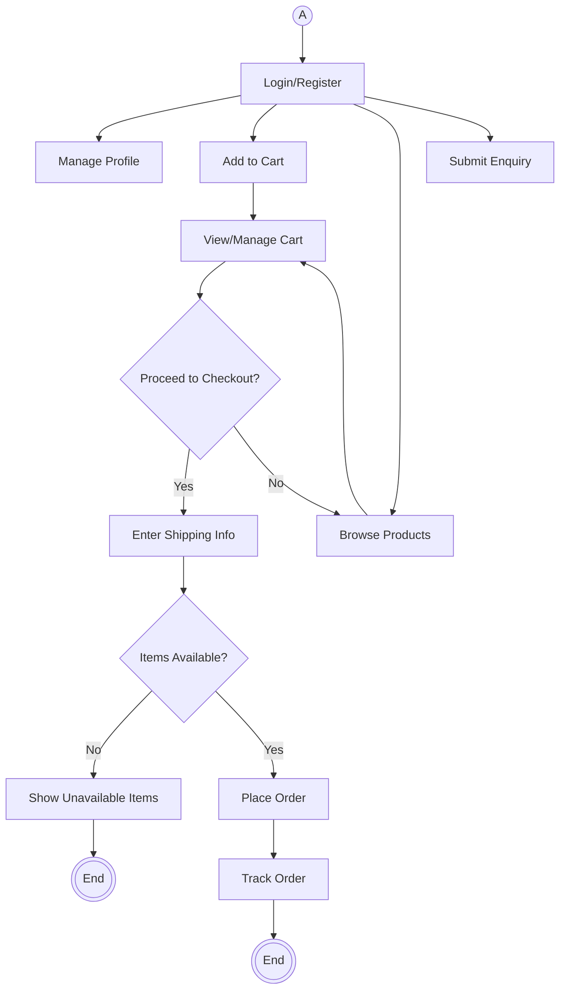
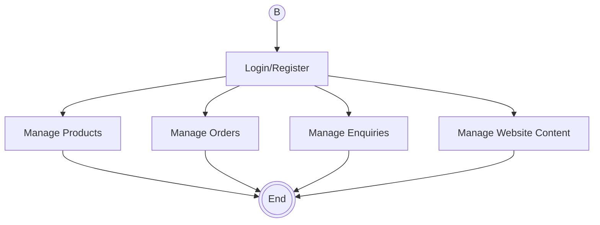
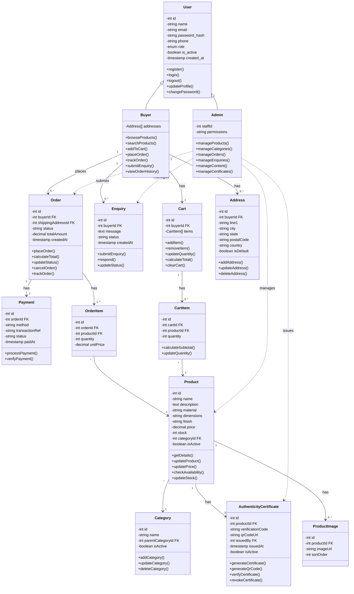

# ETERNUM — System Design

**Presented by:** Cyrus P Kuruvilla
**Roll No:** 23

---

## Use Case Diagram



---

## Activity Diagram

### Entry Flow



### User Flow (A)



### Admin Flow (B)



---

## Class Diagram



---

## Database Design

### Schema

```
users (id PK, name, email UNIQUE, password_hash, role, phone, is_active, created_at)
addresses (id PK, user_id FK→users.id, line1, line2, city, state, postal_code, country, is_default)
categories (id PK, name, is_active)
products (id PK, category_id FK→categories.id, name, description, material, length, width, height, finish, price, stock, is_active, created_at)
product_images (id PK, product_id FK→products.id, image_url)
carts (id PK, user_id FK→users.id UNIQUE)
cart_items (id PK, cart_id FK→carts.id, product_id FK→products.id, quantity, added_at, UNIQUE(cart_id, product_id))
orders (id PK, user_id FK→users.id, shipping_address_id FK→addresses.id, status, total_amount, created_at)
order_items (id PK, order_id FK→orders.id, product_id FK→products.id, quantity, unit_price)
payments (id PK, order_id FK→orders.id UNIQUE, method, transaction_ref, status, paid_at)
invoices (id PK, order_id FK→orders.id UNIQUE, invoice_number UNIQUE, invoice_date, total_amount, status)
enquiries (id PK, user_id FK→users.id, message, status, created_at)
authenticity_certificates (id PK, product_id FK→products.id UNIQUE, verification_code UNIQUE, qr_code_url, issued_by FK→users.id, issued_at, is_active)
system_settings (id PK, setting_key UNIQUE, setting_value, updated_by FK→users.id, updated_at)
```

### Tables

#### Table: users

| Field | Data Type | Key / Relation | Description / Constraints |
|-------|-----------|----------------|---------------------------|
| id | INT | PK | Auto-incrementing user identifier |
| name | VARCHAR(150) | | Full name; not null |
| email | VARCHAR(150) | UNIQUE | Login identifier; not null |
| password_hash | VARCHAR(255) | | Securely hashed password; not null |
| role | VARCHAR(20) | | One of user, admin; not null |
| phone | VARCHAR(20) | | Optional contact number |
| is_active | BOOLEAN | | Default TRUE; used to deactivate accounts |
| created_at | TIMESTAMP | | Default NOW() |

#### Table: addresses

| Field | Data Type | Key / Relation | Description / Constraints |
|-------|-----------|----------------|---------------------------|
| id | INT | PK | Auto-incrementing identifier |
| user_id | INTEGER | FK → users.id | Not null |
| line1 | VARCHAR(200) | | Not null |
| line2 | VARCHAR(200) | | Nullable |
| city | VARCHAR(100) | | Not null |
| state | VARCHAR(100) | | Not null |
| postal_code | VARCHAR(20) | | Not null |
| country | VARCHAR(100) | | Not null |
| is_default | BOOLEAN | | Default FALSE |

> **Changed:** buyer_id → user_id. There is no separate buyer table.

#### Table: categories

| Field | Data Type | Key / Relation | Description / Constraints |
|-------|-----------|----------------|---------------------------|
| id | INT | PK | Auto-incrementing category identifier |
| name | VARCHAR(100) | | Not null (e.g. Wooden, Metal, Eco-Friendly, Premium) |
| is_active | BOOLEAN | | Default TRUE |

> **Removed:** parent_category_id. Categories are simple, independent categories.

#### Table: products

| Field | Data Type | Key / Relation | Description / Constraints |
|-------|-----------|----------------|---------------------------|
| id | INT | PK | Auto-incrementing product identifier |
| category_id | INTEGER | FK → categories.id | Nullable |
| name | VARCHAR(200) | | Not null |
| description | TEXT | | Nullable |
| material | VARCHAR(100) | | Nullable |
| length | VARCHAR(100) | | Nullable |
| width | VARCHAR(100) | | Nullable |
| height | VARCHAR(100) | | Nullable |
| finish | VARCHAR(100) | | Nullable |
| price | DECIMAL(10,2) | | Not null |
| stock | INTEGER | | Default 0 |
| is_active | BOOLEAN | | Default TRUE |
| created_at | TIMESTAMP | | Default NOW() |

> **Changed:** dimensions → length, width, height.

#### Table: product_images

| Field | Data Type | Key / Relation | Description / Constraints |
|-------|-----------|----------------|---------------------------|
| id | INT | PK | Auto-incrementing image identifier |
| product_id | INTEGER | FK → products.id | Not null |
| image_url | VARCHAR(500) | | Not null |

> **Removed:** sort_order. A product can simply have multiple images.

#### Table: carts

| Field | Data Type | Key / Relation | Description / Constraints |
|-------|-----------|----------------|---------------------------|
| id | INT | PK | Auto-incrementing identifier (Cart ID) |
| user_id | INTEGER | FK → users.id, UNIQUE | One cart per user |

#### Table: cart_items

| Field | Data Type | Key / Relation | Description / Constraints |
|-------|-----------|----------------|---------------------------|
| id | INT | PK | Auto-incrementing identifier |
| cart_id | INTEGER | FK → carts.id | Not null |
| product_id | INTEGER | FK → products.id | Not null |
| quantity | INTEGER | | Default 1 |
| added_at | TIMESTAMP | | Default NOW() |

> UNIQUE(cart_id, product_id) — prevents the same product being entered twice in the same cart.

#### Table: orders

| Field | Data Type | Key / Relation | Description / Constraints |
|-------|-----------|----------------|---------------------------|
| id | INT | PK | Auto-incrementing order identifier |
| user_id | INTEGER | FK → users.id | Not null |
| shipping_address_id | INTEGER | FK → addresses.id | Not null |
| status | VARCHAR(20) | | placed, confirmed, delivered, or cancelled; default placed |
| total_amount | DECIMAL(10,2) | | Not null |
| created_at | TIMESTAMP | | Default NOW() |

> **Changed:** buyer_id → user_id.

#### Table: order_items

| Field | Data Type | Key / Relation | Description / Constraints |
|-------|-----------|----------------|---------------------------|
| id | INT | PK | Auto-incrementing identifier |
| order_id | INTEGER | FK → orders.id | Not null |
| product_id | INTEGER | FK → products.id | Not null |
| quantity | INTEGER | | Not null |
| unit_price | DECIMAL(10,2) | | Price at time of purchase; not null |

#### Table: payments

| Field | Data Type | Key / Relation | Description / Constraints |
|-------|-----------|----------------|---------------------------|
| id | INT | PK | Auto-incrementing identifier |
| order_id | INTEGER | FK → orders.id, UNIQUE | One payment record per order |
| method | VARCHAR(50) | | e.g. card, UPI, sandbox; not null |
| transaction_ref | VARCHAR(100) | | Nullable; sandbox/gateway reference |
| status | VARCHAR(20) | | success, failed, or pending; not null |
| paid_at | TIMESTAMP | | Nullable; set on success |

#### Table: invoices

| Field | Data Type | Key / Relation | Description / Constraints |
|-------|-----------|----------------|---------------------------|
| id | INT | PK | Auto-incrementing identifier |
| order_id | INTEGER | FK → orders.id, UNIQUE | One invoice per order |
| invoice_number | VARCHAR(100) | UNIQUE | Not null |
| invoice_date | TIMESTAMP | | Not null |
| total_amount | DECIMAL(10,2) | | Not null |
| status | VARCHAR(20) | | Not null |

> **New table.** One invoice per order.

#### Table: enquiries

| Field | Data Type | Key / Relation | Description / Constraints |
|-------|-----------|----------------|---------------------------|
| id | INT | PK | Auto-incrementing identifier |
| user_id | INTEGER | FK → users.id | Not null |
| message | TEXT | | Not null |
| status | VARCHAR(20) | | Open, Responded, or Closed; default Open |
| created_at | TIMESTAMP | | Default NOW() |

> **Changed:** buyer_id → user_id.

#### Table: authenticity_certificates

| Field | Data Type | Key / Relation | Description / Constraints |
|-------|-----------|----------------|---------------------------|
| id | INT | PK | Auto-incrementing identifier |
| product_id | INTEGER | FK → products.id, UNIQUE | Not null |
| verification_code | VARCHAR(50) | UNIQUE | Not null |
| qr_code_url | VARCHAR(500) | | Nullable |
| issued_by | INTEGER | FK → users.id | Admin who issued it; not null |
| issued_at | TIMESTAMP | | Default NOW() |
| is_active | BOOLEAN | | Default TRUE; FALSE marks a revoked certificate |

> product_id UNIQUE means one certificate per product.

#### Table: system_settings

| Field | Data Type | Key / Relation | Description / Constraints |
|-------|-----------|----------------|---------------------------|
| id | INT | PK | Auto-incrementing identifier |
| setting_key | VARCHAR(100) | UNIQUE | Not null |
| setting_value | TEXT | | Nullable |
| updated_by | INTEGER | FK → users.id | Nullable |
| updated_at | TIMESTAMP | | Default NOW() |

---

## User Interface Designs

### Home Page

Wireframe layout (top to bottom):

- **Navigation bar:** ETERNUM logo · Home, Catalog, About Us, FAQ, Contact · Search, Login, Cart (0)
- **Hero banner:** Reassuring imagery / brand message — *"A Dignified Choice for Every Family"*
- **Browse by Category:** Wooden Caskets · Metal Caskets · Eco-Friendly · Premium / Custom
- **Featured Products:** four product image tiles
- **Why Choose Eternum:** "Respectful, transparent pricing" panel, alongside a **"Need Help Urgently?"** box — *"Submit a custom or urgent enquiry and our team will respond promptly."* with a **Submit Enquiry** button
- **Testimonials:** three testimonial tiles
- **Newsletter:** email address field with **Notify Me** button
- **Footer:** About · Contact · FAQ · Terms & Privacy · © Eternum

### Login Page

- **Navigation bar:** ETERNUM · Home, Catalog, Login, Sign Up · Cart (0)
- **Log In card:** "Welcome back to Eternum"
  - Email Address field
  - Password field
  - "Remember me" checkbox and "Forgot password?" link
  - **Log In** button
  - "— or —" **Continue with Google**
  - "Don't have an account? Sign Up"
  - Note: *"Admin accounts are created internally and log in here using the same form."*
- **Footer:** About · Contact · FAQ · Terms & Privacy · © Eternum

### Sign-up Page

- **Navigation bar:** ETERNUM · Home, Catalog, Login, Sign Up · Cart (0)
- **Create Account card:** "Join Eternum — register to get started"
  - Full Name
  - Email Address
  - Phone Number (optional)
  - Password
  - Confirm Password
  - Checkbox: "I agree to the Terms & Privacy Policy"
  - **Create Account** button
  - "— or —" **Continue with Google**
  - "Already have an account? Log In"
  - Note: *"Public sign-up creates a User account only. Admin accounts have no public registration."*
- **Footer:** About · Contact · FAQ · Terms & Privacy · © Eternum
